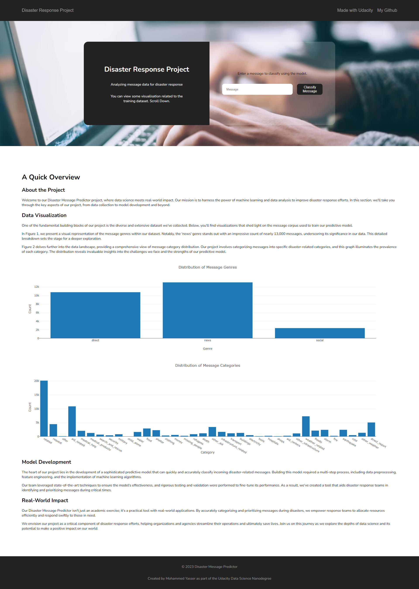
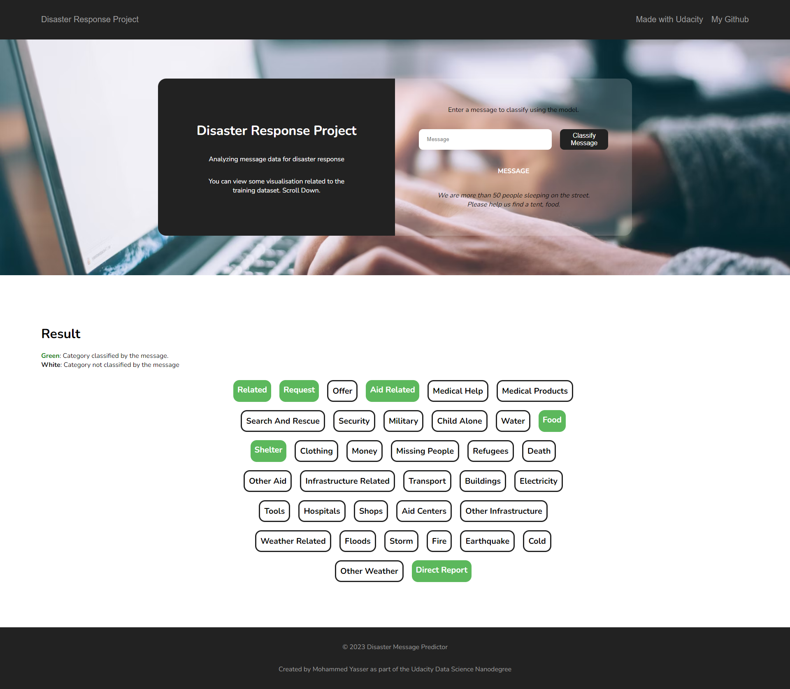

# Disaster Message Predictor Project

## Table of Contents
 * [Project Motivation](#project-motivation)
 * [File Descriptions](#file-descriptions)
 * [Components](#components)
 * [Instructions on How to Interact With Project](#instructions-on-how-to-interact-with-project)
 * [Licensing, Authors, Acknowledgements, etc.](#licensing-authors-acknowledgements-etc)

### Project Motivation
In this project, I have leveraged my data engineering and data science skills to create a Disaster Message Predictor. The goal of this project is to analyze disaster data and build a machine learning model that can classify disaster-related messages. The project includes a web app where users can input a message, and the model will categorize it into relevant disaster response categories.

### File Descriptions
- **app**
  - **template**
    - `go.html` - Classification result page of the web app.
    - `master.html` - Main page of the web app.
  - `run.py` - Flask file that runs the web app.

- **data**
  - `disaster_categories.csv` - Data file containing message categories.
  - `disaster_messages.csv` - Data file containing disaster-related messages.
  - `main.py` - Main data processing script.
  - `process_data.py` - Python script for data cleaning and processing.

- **models**
  - `data_loader.py` - Script for loading and preprocessing data.
  - `main.py` - Main script for model training and evaluation.
  - `model_builder.py` - Python script for building and saving the machine learning model.

- `README.md` - This documentation file.

### Components
There are three main components in this project:

#### 1. ETL Pipeline
The `process_data.py` script performs the following tasks:
 - Loads the messages and categories datasets.
 - Merges the two datasets.
 - Cleans and preprocesses the data.
 - Stores the cleaned data in an SQLite database.

#### 2. ML Pipeline
The `main.py` script implements the machine learning pipeline, which involves:
 - Loading data from the SQLite database.
 - Splitting the dataset into training and test sets.
 - Building a text processing and machine learning pipeline.
 - Training and tuning a model using GridSearchCV.
 - Evaluating the model on the test set.
 - Exporting the final model as a pickle file.

#### 3. Flask Web App
The project includes a web app where users can interact with the model. Users can input a message and get classification results in several categories. The web app also displays visualizations of the data.

Here are some screenshots of the web app:




### Instructions on How to Interact With Project:
1. Run the following commands in the project's root directory to set up your database and model:

    - To run the ETL pipeline that cleans data and stores it in the database:
        ```
        python data/main.py data/disaster_messages.csv data/disaster_categories.csv data/DisasterResponse.db
        ```

    - To run the ML pipeline that trains the classifier and saves the model:
        ```
        python models/main.py data/DisasterResponse.db models/classifier.pkl
        ```

2. Run the following command in the app's directory to start the web app:
    ```
    python app/run.py
    ```

3. Access the web app in your browser at [http://localhost:3001/](http://localhost:3001/).

### Licensing, Authors, Acknowledgements, etc.
Thanks to Udacity for providing the starter code and guidance for this project.


